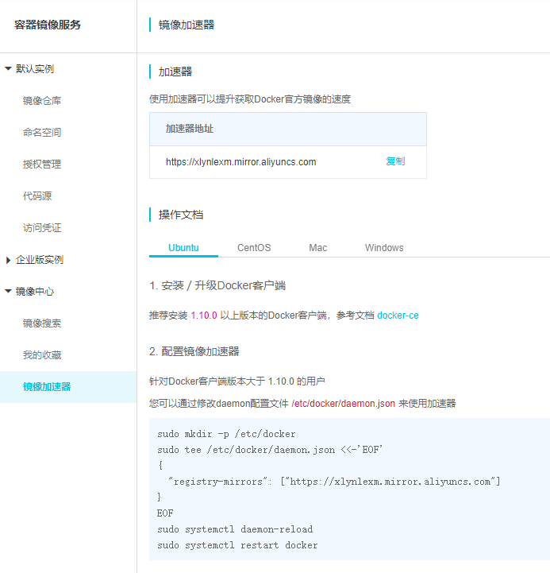

## Docker安装

如果之前安装过Docker的旧版本，可以使用下面的命令进行卸载：

```
sudo apt-get remove docker docker-engine docker.io
```

Ubuntu 16.04 安装：

```
# step 1: 安装必要的一些系统工具
sudo apt-get update
sudo apt-get -y install apt-transport-https ca-certificates curl software-properties-common
# step 2: 安装GPG证书
curl -fsSL http://mirrors.aliyun.com/docker-ce/linux/ubuntu/gpg | sudo apt-key add -
# Step 3: 写入软件源信息
sudo add-apt-repository "deb [arch=amd64] http://mirrors.aliyun.com/docker-ce/linux/ubuntu $(lsb_release -cs) stable"
# Step 4: 更新并安装 Docker-CE
sudo apt-get -y update
sudo apt-get -y install docker-ce

```

启动docker并设置开机启动：

```
sudo systemctl start docker
sudo systemctl enable docker
```

创建 Docker 用户组，将应用用户加入 Docker 用户组(这样可以免去输 **sudo** 的麻烦)

```
sudo groupadd docker                         //创建docker用户组
sudo usermod -aG docker ${USER}              //将应用用户加入docker用户组，${USER} 是用户名
sudo systemctl restart docker                //重启docker服务
su root                                      //切换到root用户，或者 sudo su
su ${USER}                                   //再切换到原来的应用用户以上配置才生效
```

运行 hello-world 镜像(测试是否安装成功)

```
docker run hello-world
```


## Nvidia-docker安装

官方教程：https://github.com/NVIDIA/nvidia-docker

安装：

```
# Add the package repositories
distribution=$(. /etc/os-release;echo $ID$VERSION_ID)
curl -s -L https://nvidia.github.io/nvidia-docker/gpgkey | sudo apt-key add -
curl -s -L https://nvidia.github.io/nvidia-docker/$distribution/nvidia-docker.list | sudo tee /etc/apt/sources.list.d/nvidia-docker.list

sudo apt-get update && sudo apt-get install -y nvidia-container-toolkit
sudo systemctl restart docker
```

测试：

```
#### Test nvidia-smi with the latest official CUDA image
docker run --gpus all nvidia/cuda:10.0-base nvidia-smi

# Start a GPU enabled container on two GPUs
docker run --gpus 2 nvidia/cuda:10.0-base nvidia-smi

# Starting a GPU enabled container on specific GPUs
docker run --gpus '"device=1,2"' nvidia/cuda:10.0-base nvidia-smi
docker run --gpus '"device=UUID-ABCDEF,1"' nvidia/cuda:10.0-base nvidia-smi

# Specifying a capability (graphics, compute, ...) for my container
# Note this is rarely if ever used this way
docker run --gpus all,capabilities=utility nvidia/cuda:10.0-base nvidia-smi
```


## 阿里云镜像加速器

```
mkdir -p /etc/docker
cd /etc/docker

vim daemon.json 

"""
{
  "registry-mirrors": [
  "https://xlynlexm.mirror.aliyuncs.com",
  "https://registry.docker-cn.com",
  "http://hub-mirror.c.163.com"
  ]
}
"""

sudo systemctl daemon-reload
sudo systemctl restart docker
```

