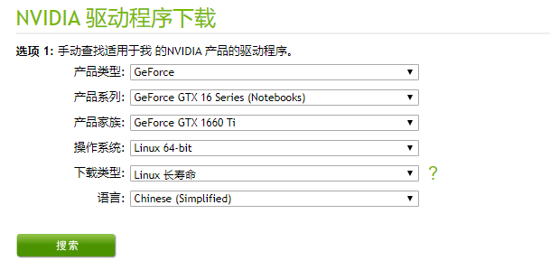
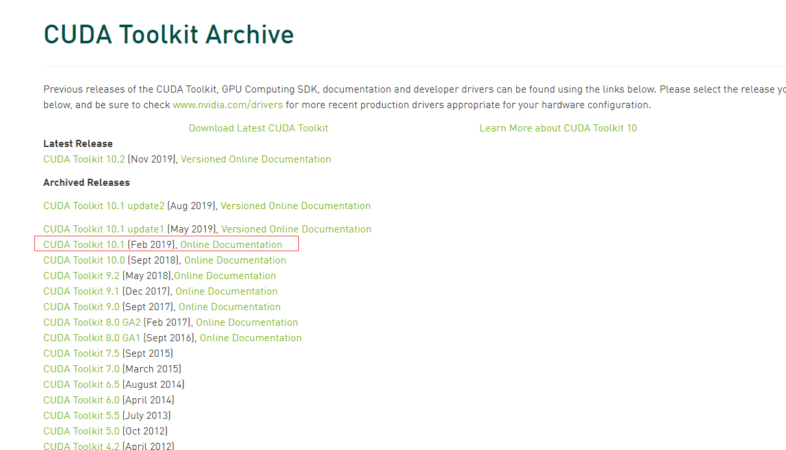
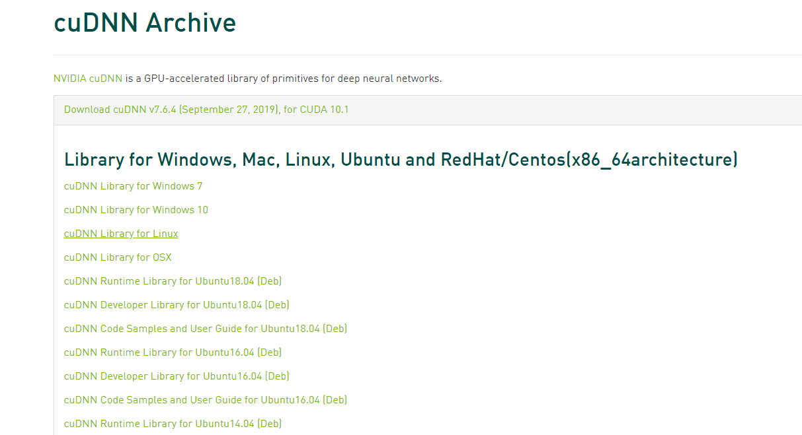

## 显卡环境

- 显卡驱动
- cuda
- cudnn


**显卡驱动：**

https://www.nvidia.cn/Download/index.aspx?lang=cn




**cuda：**

https://developer.nvidia.com/cuda-toolkit-archive



```
Installation Instructions:
Run `sudo sh cuda_10.1.105_418.39_linux.run`
Follow the command-line prompts
```

**cudnn:**

https://developer.nvidia.com/rdp/cudnn-archive



```
$ cp  cudnn-8.0-linux-x64-v5.1.solitairetheme8 cudnn-8.0-linux-x64-v5.1.tgz
$ tar -xvf cudnn-8.0-linux-x64-v5.1.tgz
```


## 运维环境

- docker
- nvidia-docker


## python环境

- anaconda


## 常用工具

- typora

```
# or run:
# sudo apt-key adv --keyserver keyserver.ubuntu.com --recv-keys BA300B7755AFCFAE
wget -qO - https://typora.io/linux/public-key.asc | sudo apt-key add -
# add Typora's repository
sudo add-apt-repository 'deb https://typora.io/linux ./'
sudo apt-get update
# install typora
sudo apt-get install typora

sudo apt-get upgrade
```


- gcc

```
apt update
apt install build-essential
```

- git

```
apt-get install git
```

