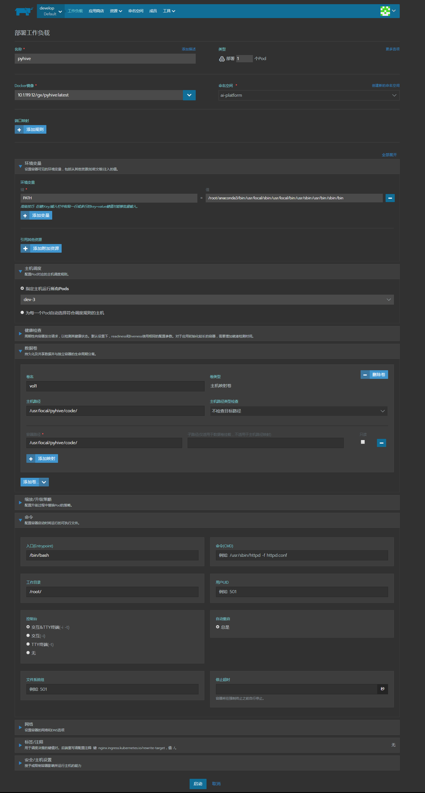
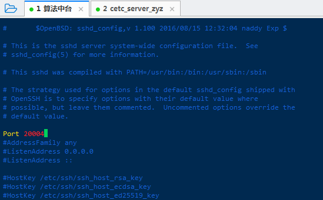
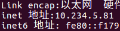

# Docker使用命令

---

[TOC]


## Docker常用命令

进入容器：

```
docker exec -it centos7 bash 
docker exec -it centos7 /bin/bash 
```

启动所有容器:

```
docker start $(docker ps -a | awk '{ print $1}' | tail -n +2)
```


容器外使用命令：

```
docker exec -i zhuangyuzhou /bin/bash -c "service ssh start"

产品部gpu容器,容器名：chanpingbu, 主机:172.16.120.3，端口：50016， 用户名:root, 密码：chanpingbu
工作目录主要在/root/下的nfs和commondata目录下
```


启动容器： 

```
docker run -id --hostname=suanfapingtai --name=suanfapingtai -p 20001:20001 -p 20002:20002 -p 20003:20003 -p 20004:20004 -p 20005:20005 10.1.119.12/gx/suanfapingtai:2 bash

# cpu算法服务
docker run -id --hostname=ai-video-tagging --name=ai-video-tagging -p 22222:22222 -p 22223:22223 ai-video-tagging:latest bash

docker run -id --hostname=ai-video-tagging --name=ai-video-tagging -net host -p 22222:22222 -p 22223:22223 ai-video-tagging:latest bash
# 多彩云
docker run -id --hostname=ai-video-tagging --name=ai-video-tagging --net host -p 22222:22222 -p 22223:22223 ai-video-tagging:latest bash


docker run -id --privileged=true --hostname=pyhive --name=pyhive ubuntu:xenial bash


docker run -id --privileged=true --name multimodal_mongo_service --hostname multimodal_mongo_service -p 50015:22 -p 8888:8080 cloud/mongo-service:latest bash


# jupyterhub
docker run -id --hostname=sf-jupyterhub --name=sf-jupyterhub -p 30001:30001 -p 30002:30002 -p 30003:30003 -p 30004:30004 -p 30005:30005 -v /root/algorithm-platform-jupyterhub/:/root/algorithm-platform-jupyterhub/ jupyterhub/jupyterhub:1.0.0 bash


# 算法中台镜像打包
docker run -id --hostname=suanfapingtai --name=suanfapingtai --workdir=/root/Algorithm_Platform_Notebook_Backend/python_online_compiler/online_python_executor_v4/online_executor_server/  -v /root/algorithm-platform:/algorithm-platform --env PATH=/root/anaconda3/bin:/root/anaconda3/bin:/usr/local/sbin:/usr/local/bin:/usr/sbin:/usr/bin:/sbin:/bin -p 20001:20001 -p 20002:20002 -p 20003:20003 -p 20004:20004 -p 20005:20005 10.1.119.12/gx/suanfapingtai:2 python app.py


docker run --workdir=/root/Algorithm_Platform_Notebook_Backend/python_online_compiler/online_python_executor_v4/online_executor_server/ -v /root/algorithm-platform:/algorithm-platform --env PATH=/root/anaconda3/bin:/root/anaconda3/bin:/usr/local/sbin:/usr/local/bin:/usr/sbin:/usr/bin:/sbin:/bin -it 10.1.119.12/gx/suanfapingtai:2 python app.py
#############################################


docker run -id --hostname=trash_intelligent_classification --name=trash_intelligent_classification --mount type=bind,source=/root/trash_intelligent_classification/trash_algorithm_files/,target=/root/trash_intelligent_classification/trash_algorithm_files/ -p 20001:20001 -p 20002:20002 -p 20003:20003 -p 8501:8501 -p 8500:8500 tensorflow/serving:latest bash

sudo nvidia-docker run -id --privileged=true --name zhuangyuzhou --hostname zhuangyuzhou --mount type=bind,source=/usr/local/cuda/,target=/usr/local/cuda --mount type=bind,source=/data/,target=/root/commondata --mount type=bind,source=/usr/share/i18n/,target=/usr/share/i18n/ -p 50008:22 -p 50108:8888 -t nd:v0.5_zh bash

nvidia-docker run -id --privileged=true --name wangjin-cmr --hostname wangjin-cmr --mount type=bind,source=/usr/local/cuda/,target=/usr/local/cuda --mount type=bind,source=/data/,target=/root/commondata --mount type=bind,source=/usr/share/i18n/,target=/usr/share/i18n/ -p 50018:22 -p 50118:8888 -p 6665:6665 -p 6666:6666 -p 6667:6667 wangjin-cmr bash


nvidia-docker run -id --privileged=true --name multimodal_eval --hostname multimodal_eval -p 50012:22 -p 50112:8888 registry.cn-shanghai.aliyuncs.com/tcc-public/tensorflow:1.12.0-cuda9.0-py3  bash

# centos
nvidia-docker run -id --privileged=true --name multimodal_centos_face --hostname multimodal_centos_face -p 50013:22 -p 50113:8888 centos7_face_image:latest  /usr/sbin/init

# center cloud
docker run -id --privileged=true --name multimodal_eval_center --hostname multimodal_eval_center -p 50014:22 -p 1111:1111 cloud/registry-center:latest bash


# mongo service
docker run -id --privileged=true --name multimodal_mongo_service --hostname multimodal_mongo_service -p 50015:22 -p 8888:8080 cloud/mongo-service:latest bash


# gpu 10.0
nvidia-docker run -id --privileged=true --name multimodal_gpu_10 --hostname multimodal_gpu_10 --mount type=bind,source=/usr/local/cuda/,target=/usr/local/cuda --mount type=bind,source=/usr/share/i18n/,target=/usr/share/i18n/ -p 50016:22 -p 18091:8091 -p 18981:8981 -p 18094:8094 -p 11111:1111 nd:v0.5_zh bash


nvidia-docker run -id --privileged=true --name multimodal_gpu_10 --hostname multimodal_gpu_10 --mount type=bind,source=/usr/local/cuda/,target=/usr/local/cuda --mount type=bind,source=/usr/share/i18n/,target=/usr/share/i18n/ -p 50016:22 -p 18091:8091 -p 18981:8981 -p 18094:8094 -p 11111:1111 multimodal_gpu_10_image:latest bash


# 垃圾分类算法产品
nvidia-docker run -id --privileged=true --name zyz_trash_classification_product --hostname zyz_trash_classification_product --mount type=bind,source=/usr/local/cuda/,target=/usr/local/cuda --mount type=bind,source=/data/,target=/root/commondata --mount type=bind,source=/usr/share/i18n/,target=/usr/share/i18n/ -p 50014:22 -p 18091:8091 -p 18981:8981 -p 18094:8094 -p 11111:1111 nd:v0.5_zh bash


```

```
nvidia-docker run -id --privileged=true -v 宿主机文件夹地址:容器文件夹地址 -p 22:22 镜像名称:版本 bash
```


根据dockerfile创建镜像

```
docker build -f /path/to/a/Dockerfile -t docker_file_image:v1.0 .

docker build -f ./deepo/DockerFile . -t deepo:v1.0
```


停止容器：

```
docker stop centos7
```

删除容器：

```
docker rm centos7 
```

删除运行中的容器： 

```
docker rm -f centos7 
```

删除镜像： 

```
docker rmi test:ts
```

查看正在运行的容器：

```
docker ps
```

将容器提交为镜像： 

```
docker commit 36dc403b0957 suafapingtai:v1.0
docker commit suanfapingtai suanfapingtai-image:v1.0
# 镜像
docker save image_name > /test.tar
# 容器
docker export -o test.img test
```


导出容器：

```
docker export suanfapingtai> suanfapingtai.tar 
```

导入容器：

```
docker import suanfapingtai.tar suanfapingtai
```


导出镜像：

```
docker save <myimage>:<tag> | gzip > <myimage>_<tag>.tar.gz

docker save > mysql.tar pinpointdocker/pinpoint-mysql:1.8.3 
```

导入镜像：

```
docker load < mysql.tar 
```


docker调用容器环境运行文件

```
docker exec -i suanfapingtai /bin/bash -c "source /root/.bashrc;cd /algorithm-platform/algorithm_model_code/ && python dag_model_test_task_1.py"
```


容器ip查看

```
docker inspect `container_name or container_id` | grep IPAddress
```


查看端口映射情况：

```
 iptables -t nat --list
```


## 算法中台容器更新

需求：

```
容器名字： python-notebook  挂载目录(容器和宿主机一致)：/usr/local/datascience/
```

操作：

```
docker commit 36dc403b0957 python-notebook:latest


# 镜像测试
docker run -id --hostname=python-notebook --name=python-notebook --workdir=/root/Algorithm_Platform_Notebook_Backend/python_online_compiler/online_python_executor_v4/online_executor_server/  -v /usr/local/datascience/:/usr/local/datascience/ --env PATH=/root/anaconda3/bin:/root/anaconda3/bin:/usr/local/sbin:/usr/local/bin:/usr/sbin:/usr/bin:/sbin:/bin -p 20001:20001 -p 20002:20002 -p 20003:20003 -p 20004:20004 -p 20005:20005 10.1.119.12/gx/python-notebook:latest python app.py


# 镜像导出
docker save > python-notebook.tar  python-notebook:latest

# 镜像导入和换名
docker load < python-notebook.tar 
docker tag python-notebook:latest 10.1.119.12/gx/python-notebook:latest

# Habor上传
docker login 10.1.119.12 -u admin -p Harbor12345
docker push 10.1.119.12/gx/python-notebook:latest


```

```
# 镜像导入
docker load < python-notebook.tar 
docker tag python-notebook:latest  10.5.9.84/dcy/python-notebook:latest

docker run -id --hostname=python-notebook --name=python-notebook --workdir=/root/Algorithm_Platform_Notebook_Backend/python_online_compiler/online_python_executor_v4/online_executor_server/  -v /usr/local/datascience/:/usr/local/datascience/ --env PATH=/root/anaconda3/bin:/root/anaconda3/bin:/usr/local/sbin:/usr/local/bin:/usr/sbin:/usr/bin:/sbin:/bin -p 20001:20001 -p 20002:20002 -p 20003:20003 -p 20004:20004 -p 20005:20005 10.5.9.84/dcy/python-notebook:latest python app.py
```


## 迁移habor以及rancher

```
# 算法中台镜像打包
docker run -id --hostname=suanfapingtai --name=suanfapingtai --workdir=/root/Algorithm_Platform_Notebook_Backend/python_online_compiler/online_python_executor_v4/online_executor_server/  -v /root/algorithm-platform:/algorithm-platform --env PATH=/root/anaconda3/bin:/root/anaconda3/bin:/usr/local/sbin:/usr/local/bin:/usr/sbin:/usr/bin:/sbin:/bin -p 20001:20001 -p 20002:20002 -p 20003:20003 -p 20004:20004 -p 20005:20005 10.1.119.12/gx/suanfapingtai:2 python app.py


# 容器导出
docker export suanfapingtai> suanfapingtai.tar 

# 容器导入
docker import suanfapingtai.tar suanfapingtai
#harbor登录地址和账号
http://10.1.119.12/harbor/sign-in?redirect_url=%2Fharbor%2Fprojects
用户名：admin
密码：Harbor12345

# rancher登录地址和账号
https://10.1.119.12:9443/login
用户名：admin
密码：admin
```

```
# 镜像
docker login 10.1.119.12 -u admin -p Harbor12345

docker tag suanfapingtai 10.1.119.12/gx/suanfapingtai:2

docker push 10.1.119.12/gx/suanfapingtai:2
```

pyhive导出：

```
# pyhive
# node5
#容器导出
docker export pyhive >pyhive.tar

# 镜像导出
docker save > pyhive.tar  pyhive:latest


# 232
# 容器导入
docker import pyhive.tar pyhive
# 镜像导入
docker load < pyhive.tar 

docker tag pyhive 10.1.119.12/gx/pyhive:latest


docker run -id --hostname=pyhive_test --name=pyhive_test pyhive:latest bash

docker run -id --hostname=pyhive --name=pyhive 10.1.119.12/gx/pyhive:latest bash

docker run -id --hostname=pyhive --name=pyhive --workdir=/root/  -v /usr/local/pyhive/code/:/usr/local/pyhive/code/ --env PATH=/root/anaconda3/bin:/usr/local/sbin:/usr/local/bin:/usr/sbin:/usr/bin:/sbin:/bin 10.1.119.12/gx/pyhive:latest bash

# Habor上传
docker login 10.1.119.12 -u admin -p Harbor12345

docker push 10.1.119.12/gx/pyhive:latest

```




## 不重新创建docker进行端口，交换内存，挂载目录

命令：

```
# 找到要修改容器的 CONTAINER ID
docker ps -a

#显示需要的目录id
docker inspect 0ba17e3a865b | grep Id

# 进入找到与 Id 相同的目录
cd /var/lib/docker/containers

# 停止 docker 引擎服务
systemctl stop docker 或者 service docker stop

# 修改交换内存和端口
# 找到容器对应的配置文件hostconfig.json
 vi hostconfig.json
 # 找到参数"ShmSize"

 # 找到参数"PortBindings”
 
# 修改挂载目录

# 修改第一个config
vim hostconfig.json
# 修改Mounts
{"Type":"bind","Source":"/mnt/nfs/","Target":"/root/nfs"}

# 修改第二个config
 vim config.v2.json
 # MountPoints
"/mnt/nfs/":{"Source":"/mnt/nfs/","Destination":"/root/nfs","RW":true,"Name":"","Driver":"","Type":"bind","Propagation":"rprivate","Spec":{"Type":"bind","Source":"/mnt/nfs/","Target":"/root/nfs"},"SkipMountpointCreation":true}


# 启动docker服务
systemctl start docker
```


## Ubuntu开机自启动

/etc/rc.d/rc.local 用于用户自定义开机启动程序，可以往里写开机要执行的命令或脚本，线上的配置如下：

```
[root@localhost ~]$ cat /etc/rc.d/rc.local 
/data/init/restart_game.sh
touch /var/lock/subsys/local
ulimit -SHn 65535
ulimit -u 65535
/data/init/iptables.sh
rsync --daemon --config=/etc/rsyncd.conf
/usr/local/mysql/share/mysql/mysql.server start
```


## 挂载nas存储

```
apt-get install nfs-common

1、系统挂载
mount 172.16.107.8:/NAS/CAPFS/data/GXJSB/120.3_2T /mnt/nfs
2、写入开机挂载
vi /etc/fstab
172.16.107.8:/NAS/CAPFS/data/GXJSB/120.3_2T /mnt/nfs nfs defaults 0 0
```


## 阿里云镜像仓库功能

登录账号

```
docker login --username=13658597790 registry.cn-chengdu.aliyuncs.com
Password: zhuang7612637
```

将容器commit为镜像：

```
docker commit bd8bdfa2b8fc registry.cn-chengdu.aliyuncs.com/cyanzz/cetc_big_data_docker_image:cpu_tfserving_v1.0
```

将本地镜像上传到阿里云的私人仓库中：

```
docker push registry.cn-chengdu.aliyuncs.com/cyanzz/cetc_big_data_docker_image:cpu_tfserving_v1.0
```

将私仓中的镜像拉取到本地：

```
docker pull registry.cn-chengdu.aliyuncs.com/cyanzz/cetc_big_data_docker_image:cpu_tfserving_v1.0
```


## 查看服务器环境

查看cpu型号：

```
lscpu
```

查看当前操作系统版本信息

```
uname -a

cat /proc/version
```


查看容器cpu是否支持avx指令集:

```
cat /proc/cpuinfo | grep avx
```


查看内存配置：

```
free -m

```

查看显卡配置:

```
 nvidia-smi -a 
 # cuda
 cat /usr/local/cuda/version.txt
 # cudnn
 cat /usr/local/cuda/include/cudnn.h | grep CUDNN_MAJOR -A 2
```


查看当前文件或者文件夹的占用空间容量

```
du -h --max-depth=1 
```


ubuntu查看磁盘占用和分配情况

```
df   -hl
fdisk -l
```


---

## tensorlfow环境测试

```
import tensorflow as tf

hello = tf.constant("Hello TensorFlow")

sess = tf.Session()

print(sess.run(hello))
a = tf.constant(10)
b = tf.constant(32)
print(sess.run(a+b))
```


## conda换源


1、切换为清华源

```
conda config --add channels https://mirrors.tuna.tsinghua.edu.cn/anaconda/pkgs/free/
conda config --add channels https://mirrors.tuna.tsinghua.edu.cn/anaconda/cloud/conda-forge 
conda config --add channels https://mirrors.tuna.tsinghua.edu.cn/anaconda/cloud/msys2/

#设置搜索时显示通道地址

conda config --set show_channel_urls yes
```

2、切换为中科大源

```
conda config --add channels https://mirrors.ustc.edu.cn/anaconda/pkgs/main/
conda config --add channels https://mirrors.ustc.edu.cn/anaconda/pkgs/free/
conda config --add channels https://mirrors.ustc.edu.cn/anaconda/cloud/conda-forge/
conda config --add channels https://mirrors.ustc.edu.cn/anaconda/cloud/msys2/
conda config --add channels https://mirrors.ustc.edu.cn/anaconda/cloud/bioconda/
conda config --add channels https://mirrors.ustc.edu.cn/anaconda/cloud/menpo/

conda config --set show_channel_urls yes
```

3、切换回默认源

conda config --remove-key channels


---


## apt换源

```
编辑：sudo vim /etc/apt/sources.list 

# deb cdrom:[Ubuntu 16.04.5 LTS _Xenial Xerus_ - Release amd64 (20180731)]/ xenial main restricted

# See http://help.ubuntu.com/community/UpgradeNotes for how to upgrade to
# newer versions of the distribution.
deb http://cn.archive.ubuntu.com/ubuntu/ xenial main restricted
# deb-src http://cn.archive.ubuntu.com/ubuntu/ xenial main restricted

## Major bug fix updates produced after the final release of the
## distribution.
deb http://cn.archive.ubuntu.com/ubuntu/ xenial-updates main restricted
# deb-src http://cn.archive.ubuntu.com/ubuntu/ xenial-updates main restricted

## N.B. software from this repository is ENTIRELY UNSUPPORTED by the Ubuntu
## team. Also, please note that software in universe WILL NOT receive any
## review or updates from the Ubuntu security team.
deb http://cn.archive.ubuntu.com/ubuntu/ xenial universe
# deb-src http://cn.archive.ubuntu.com/ubuntu/ xenial universe
deb http://cn.archive.ubuntu.com/ubuntu/ xenial-updates universe
# deb-src http://cn.archive.ubuntu.com/ubuntu/ xenial-updates universe

## N.B. software from this repository is ENTIRELY UNSUPPORTED by the Ubuntu 
## team, and may not be under a free licence. Please satisfy yourself as to 
## your rights to use the software. Also, please note that software in 
## multiverse WILL NOT receive any review or updates from the Ubuntu
## security team.
deb http://cn.archive.ubuntu.com/ubuntu/ xenial multiverse
# deb-src http://cn.archive.ubuntu.com/ubuntu/ xenial multiverse
deb http://cn.archive.ubuntu.com/ubuntu/ xenial-updates multiverse
# deb-src http://cn.archive.ubuntu.com/ubuntu/ xenial-updates multiverse

## N.B. software from this repository may not have been tested as
## extensively as that contained in the main release, although it includes
## newer versions of some applications which may provide useful features.
## Also, please note that software in backports WILL NOT receive any review
## or updates from the Ubuntu security team.
deb http://cn.archive.ubuntu.com/ubuntu/ xenial-backports main restricted universe multiverse
# deb-src http://cn.archive.ubuntu.com/ubuntu/ xenial-backports main restricted universe multiverse

## Uncomment the following two lines to add software from Canonical's
## 'partner' repository.
## This software is not part of Ubuntu, but is offered by Canonical and the
## respective vendors as a service to Ubuntu users.
# deb http://archive.canonical.com/ubuntu xenial partner
# deb-src http://archive.canonical.com/ubuntu xenial partner

deb http://security.ubuntu.com/ubuntu xenial-security main restricted
# deb-src http://security.ubuntu.com/ubuntu xenial-security main restricted
deb http://security.ubuntu.com/ubuntu xenial-security universe
# deb-src http://security.ubuntu.com/ubuntu xenial-security universe
deb http://security.ubuntu.com/ubuntu xenial-security multiverse
deb [arch=amd64] https://download.docker.com/linux/ubuntu xenial stable
# deb-src [arch=amd64] https://download.docker.com/linux/ubuntu xenial stable
# deb-src http://security.ubuntu.com/ubuntu xenial-security multiverse


写入后，sudo apt-get update 
```


## Linux相关命令

权限查看：

```
ls -l ./xxx
```


---

## Ubuntu查看端口使用情况

安装netstat

```
sudo apt-get install net-tools  # 无法直接安装netstat
```

查看已经连接的服务端口（ESTABLISHED）

```
netstat -a
```

查看所有的服务端口（LISTEN，ESTABLISHED）

```
netstat -ap
```

查看指定端口，可以结合grep命令：

```
netstat -ap | grep 8080
```

或使用lsof命令：

```
lsof -i:8000
```


关闭端口：

查看所有应用端口

```undefined
netstat -tunple
```

关闭使用这个端口的程序，使用kill + 对应的pid

```
kill -9 PID号
```


## 查找文件

1.whereis 文件名

特点:快速,但是是模糊查找

例如：
whereis php #会把php,php.ini,php.*所在的目录都找出来.

2.find / -name 文件名

特点:准确,但速度慢,消耗资源大

例如：
如果想找到php.ini的准确位置,需要用

\#find / -name php.ini

3.locate 文件名

最快,最好的方法.
注意:第一次使用该命令,可能需要更新数据库,按照提示的命令执行一下就好了.


---


## GPU服务器使用

```
ip:172.16.120.3:22

密码:1qaz!QA

目录:/home/user/tensorflow_serving_models
```


## 解压和压缩命令

```swift
unzip -d /root/commondata/zhuangyuzhou/trash_completition CETC_HaiHua_Trash_Classification_v1.zip
```


## JupyterNotebook远程服务启动

#### 1.生成配置文件

在你的服务器上，输入如下命令：

```undefined
jupyter notebook --generate-config
```

```

```

#### 2. 启动jupyter notebook

```
# 容器ip查看
ifconfig 或者 ip addr

# ip填写容器ip，port填写映射端口
jupyter notebook --allow-root --ip=172.17.0.3 --port=20005
nohup jupyter notebook --allow-root --ip=172.17.0.3 --port=20005 > ./jupyter_running.log &

nohup jupyter notebook --allow-root --ip=172.17.0.4 --port=20005 > ./jupyter_running.log &


# tesla p100 zyz容器
nohup jupyter notebook --allow-root --ip=172.17.0.3 --port=8888 > ./jupyter_running.log &
```


#### 3.远程访问

此时你应该可以在本地浏览器访问你服务器上的jupyter了，ip为宿主机ip端口为宿主机映射端口，复制服务器端的token登录即可：

```
 http://172.16.119.8:20005
```


## JupyterLab远程服务启动

#### 1. 启动jupyter lab

```
# 容器ip查看
ifconfig 或者 ip addr

# ip填写容器ip，port填写映射端口
# 
jupyter-lab --allow-root --ip=10.1.119.13 --port=20005

nohup jupyter-lab --allow-root --ip=10.1.119.13 --port=20005 > ./jupyter_running.log &

```


#### 3.远程访问

此时你应该可以在本地浏览器访问你服务器上的jupyter了，ip为宿主机ip端口为宿主机映射端口，复制服务器端的token登录即可：

```
 http://172.16.119.8:20005
```


## vim问题

安装vim

```
apt-get install vim
```


   VIM安装成功后可以使用，但对中文是乱码，解决方法是在vim的配置文档中添加相关设置即可：

 

找到etc/vim/.vimrc

   编辑~/.vimrc文件，加上如下几行：

   set fileencodings=utf-8,ucs-bom,gb18030,gbk,gb2312,cp936
   set termencoding=utf-8
   set encoding=utf-8

   问题解决。


## SSH远程服务

#### 一、检查SSH服务是否已启动

Ubuntu系统默认是没有SSH服务的，故要检查SSH服务是否已安装。

打开**终端**输入以下指令：

```
ps -e | grep ssh

#  7529 ?        00:00:00 sshd
#  7852 pts/1    00:00:00 ssh
```

若输入指令后显示类似于上图所示，则说明SSH服务已启动

其中sshd表示ssh-server已启动，ssh表示ssh-client已启动

#### 二、安装SSH服务

安装SSH的客户端和服务端：

```
sudo apt-get install openssh-client
 
sudo apt-get install openssh-server
```

#### 三、启动SSH服务

安装完成后通过以下指令启动：

```
service ssh start
sudo /etc/init./ssh start
```

启动后通过以下指令判断SSH服务是否正确启动：

```
ps -e | grep ssh
```

若启动成功，则终端内会出现类似于第一步出现的结果

#### 四、修改SSH端口号

SSH默认端口号为22,若有修改SSH端口号的需求，则运行以下指令打开SSH配置文件：

```
sudo vim /etc/ssh/sshd_config
```

可以看到如下图所示，如果使用docker容器可以将ssh端口映射到已经设置好的端口上即可：



同时添加root用户登录：


修改端口号（Port）后，重启SSH服务即可生效，命令如下：

```
sudo /etc/init.d/ssh restart
```

设置root的ssh密码:

```
passwd root
```

输入密码，例如zhuangyuzhou作为密码

如果是容器，输入宿主机ip+映射到容器ssh的端口即可访问，用户名使用root，密码使用passwd设置的密码


#### 五、SSH远程登录

SSH服务启动后，即可远程登陆，登陆命令格式为：ssh 帐号@IP地址，例如：

```
ssh -p 20003 user@10.234.5.81
```

其中帐号指的是Ubuntu的登录帐号

若不知道IP地址可以通过以下指令查看：

```
ifconfig -a
```

输入该指令后找到如下图所示处：



其中inet即为本机IP地址

登录指令输入后根据提示输入Ubuntu下该帐号的密码即可以远程登录

远程登录后若想退出，输入以下指令即可：

```
exit
```


#### 六、数据传输

完成SSH服务配置之后即可实现基于SSH的数据传输，最常用方便的指令便是scp，以下是常用scp指令：

```
scp -r usr@43.224.34.73:/home/lk   /root  //将远程IP地址为43.224.34.73的usr用户下路径为 /home/lk 的所有文件拷贝到本地 /root 文件夹中

scp usr@43.224.34.73:/home/lk/test.jar   /root  //将远程IP地址为43.224.34.73的usr用户下路径为 /home/lk 的test.jar文件拷贝到本地 /root 文件夹中

scp -r /root  usr@43.224.34.73:/home/lk    //将本地 /root 中的所有文件拷贝到远程IP地址为43.224.34.73的usr用户下路径为 /home/lk 的文件夹中

scp /root/test.jar   usr@43.224.34.73:/home/lk   //将本地 /root 中的test.jar文件拷贝到远程IP地址为43.224.34.73的usr用户下路径为 /home/lk 的文件夹中
```

scp的通用指令格式为：scp [参数] [原路径] [目标路径]

其中-r参数意为：递归复制整个目录


centOS中配置ssh


