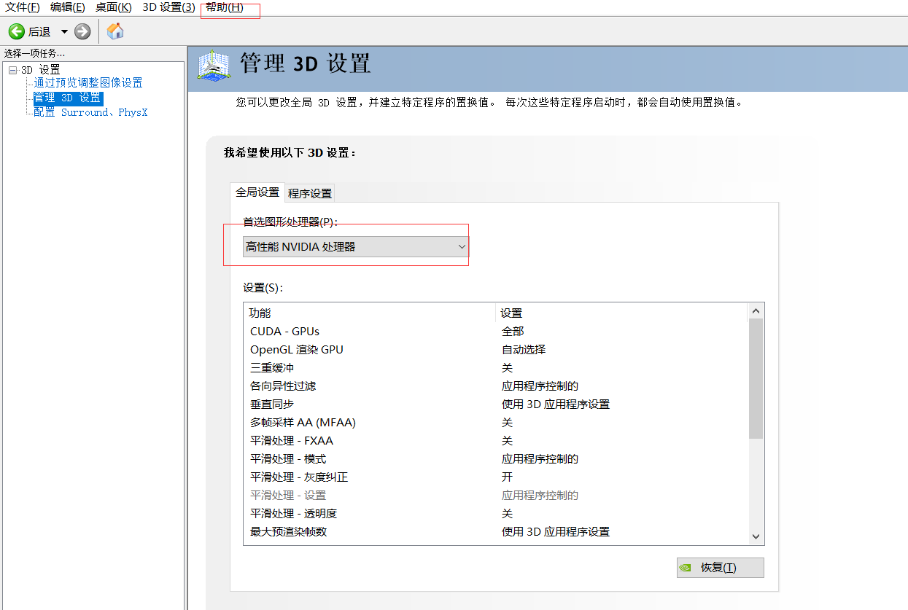
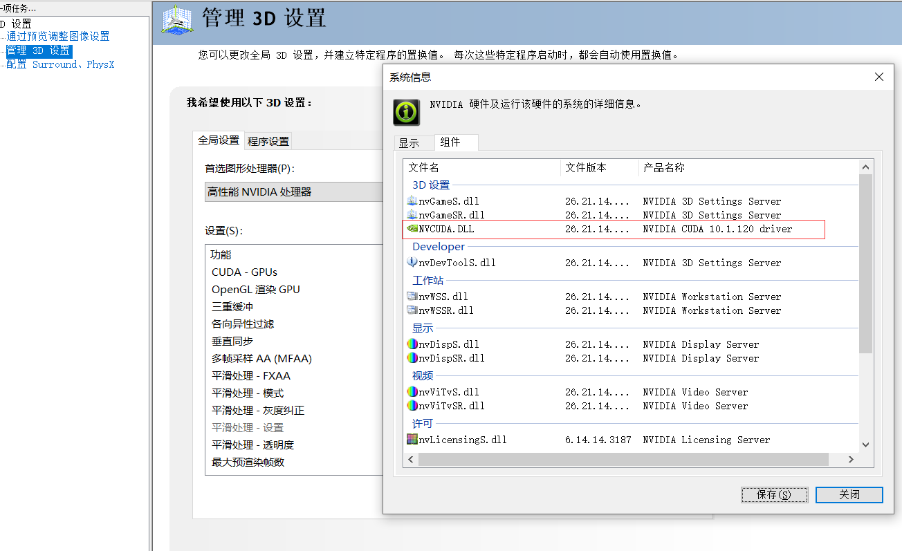
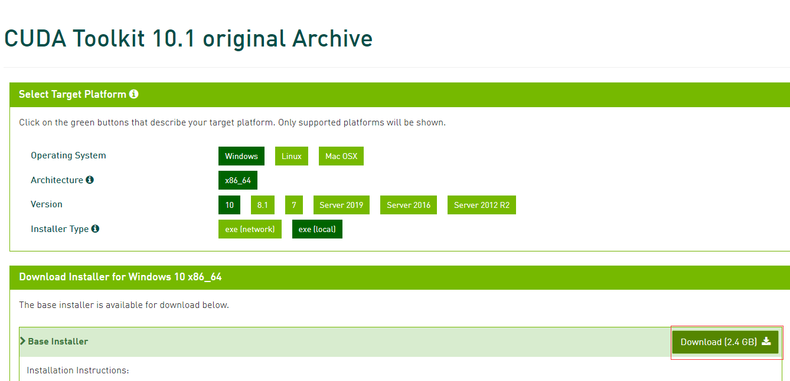
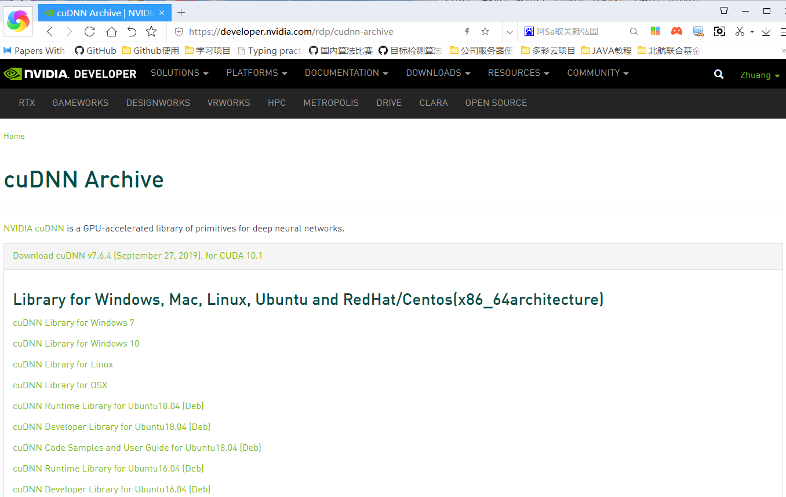
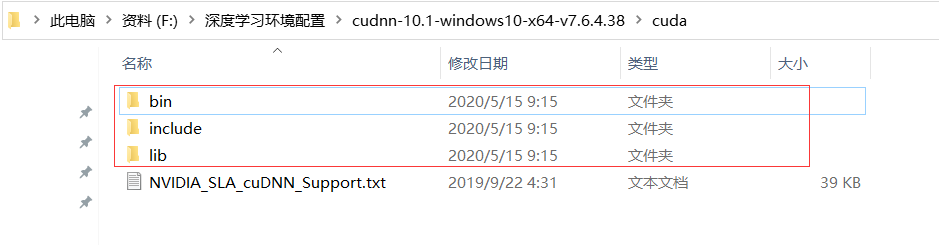
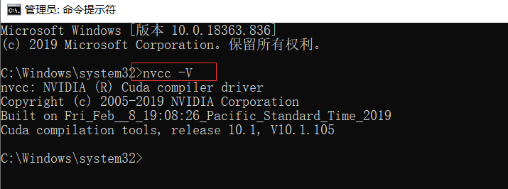
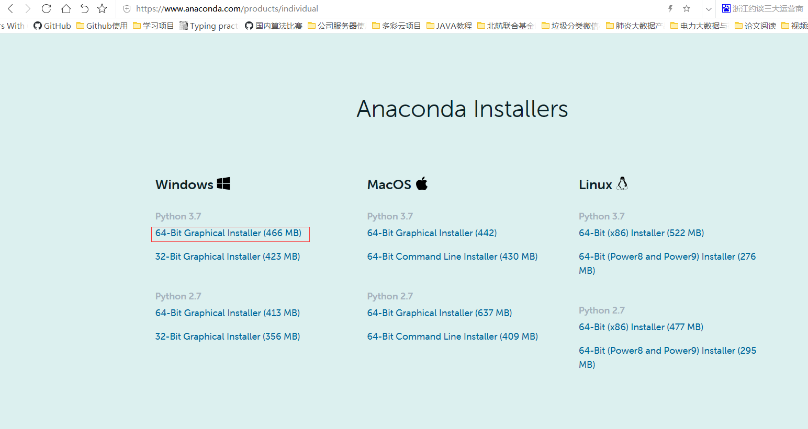

# Windows深度学习环境搭建

## 1.设置首选图形处理器

在NVIDIA 控制面板中 -> 选择管理 3D 设置 -> 全局设置 -> 首选图形处理器中选择高性能 NVIDIA 处理器，然后点击应用




## 2.查看独显支持的Cuda版本




## 3.下载cuda

网址：https://developer.nvidia.com/cuda-toolkit-archive

配置：




## 4.下载cudnn

网址：https://developer.nvidia.com/rdp/cudnn-archive

配置：




## 5.安装CUDA并且把相应cudnn的文件夹复制到CUDA安装路径中



验证cuda安装:




## 6.安装anaconda

网址：https://www.anaconda.com/products/individual




## 7.安装深度学习环境

创建conda环境：

```
conda create -n dlpython36 python=3.6 flask pymysql moviepy
```

常用库：

```
pymysql
# 机器学习
matplotlib
pandas
numpy
seaborn
lightgbm
scikit-learn
tqdm
progressbar2

# 自然语言
gensim
jieba
beautifulsoup4

# 图像
opencv-contrib-python==3.4.2.17
opencv-python==3.4.2.17
Pillow==6.2.0
git+https://github.com/cocodataset/cocoapi.git#subdirectory=PythonAPI

# torch
torch==1.3.0

# tensorflow
Keras==2.2.5
tensorflow-gpu==1.15.0
```

torch离线下载地址

```
# CUDA 10.1
Download and install wheel from https://download.pytorch.org/whl/cu101/torch_stable.html

# CUDA 10.0
Download and install wheel from https://download.pytorch.org/whl/cu100/torch_stable.html

# CUDA 9.0
Download and install wheel from https://download.pytorch.org/whl/cu90/torch_stable.html

# CPU only
Download and install wheel from https://download.pytorch.org/whl/cpu/torch_stable.html
```

